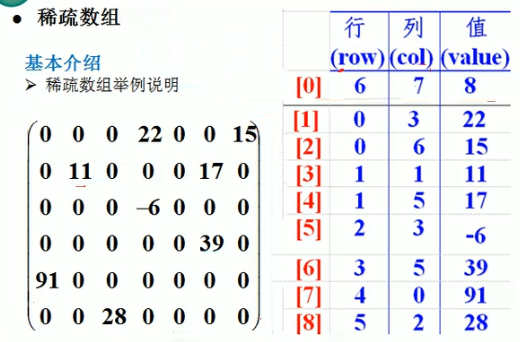

# 数据结构

## 线性结构和非线性结构

### 线性结构

1) 线性结构作为最常用的数据结构，其特点是<b>数据元素之间存在一对一的线性关系</b>

2) 线性结构有两种不同的存储结构，即顺序存储结构（数组）和链式存储结构（链表）。顺序存储的线性表称为顺序表，顺序表中的存储元素是连续的

3) 链式存储的线性表称为链表，链表中的存储元素不一定是连续的，元素节点中存放数据元素以及相邻元素的地址信息

4) 线性结构常见的有：数组、队列、链表和栈

### 非线性结构

非线性结构包括：二维数组，多维数组，广义表，树结构，图结构


## 稀疏数组和队列

### 稀疏数组

当一个数组中大部分元素为0，或者为同一个值的数组时，可以使用稀疏数组来保存该数组
稀疏数组的处理方法是：

1) 记录数组一共有几行几列，有多少个不同的值

2) 把具有不同值的元素的行列及值记录在一个小规模的数组中，从而缩小程序的规模



<b>应用实例</b>

1. 使用稀疏数组，来保留类似前面的二维数组
2. 把稀疏数组存盘，并且可以恢复为二维数组

```java
public class SparseArray {
    public static void main(String[] args){
        // 创建原始的二维数组
        int chessArr1[][] = new int[11][11];
        chessArr1[1][2] = 1;
        chessArr1[2][3] = 2;

    
        // 遍历二维数组，得到非 0 的个数
        int count = 0;
        for (int i = 0; i < chessArr1.length; i++) {
            for (int j = 0; j < chessArr1[i].length; j++) {
                if (chessArr1[i][j] != 0) {
                    count++;
                }
            }
        }

        // 创建对应的稀疏数组
        int[][] sparseArr = new int[count + 1][3];
        // 给稀疏数组赋值
        sparseArr[0][0] = 11;
        sparseArr[0][1] = 11;
        sparseArr[0][2] = count;

        // 遍历二维数组，将非 0 的值存入稀疏数组
        int index = 1;
        for (int i = 0; i < chessArr1.length; i++) {
            for (int j = 0; j < chessArr1[i].length; j++) {
                if (chessArr1[i][j] != 0) {
                    sparseArr[index][0] = i;
                    sparseArr[index][1] = j;
                    sparseArr[index][2] = chessArr1[i][j];
                    index++;
                }
            }
        }

        // 存盘
        ObjectOutputStream oos = null;
        try {
            oos = new ObjectOutputStream(new FileOutputStream("src\\map.data"));
            oos.writeObject(sparseArr);
            System.out.println("保存成功");

        } catch (IOException e) {
            e.printStackTrace();
        }finally {
            assert oos != null;
            try {
                oos.close();
            } catch (IOException e) {
                e.printStackTrace();
            }
        }


        // 恢复
        int[][] chessArr2 = new int[sparseArr[0][0]][sparseArr[0][1]];
        for(int i = 1; i < sparseArr.length; i++){
            chessArr2[sparseArr[i][0]][sparseArr[i][1]] = sparseArr[i][2];
        }
    }
}
```


### 队列

队列本身是有序列表
因为队列的输出、输入是分别从前后端来处理，因此需要两个变量front,及rear分别记录队列前后端的下标，front会随着数据输出而改变，而rear则是随着数据输入而改变

<b>数组模拟队列</b>

当我们将数据存入队列时称为"addQueue","addQueue"的处理需要有两个步骤：思路分析

1. 将尾指针往后移：rear+1,当front=rear【空】
2. 若尾指针rear小于队列的最大下标maxSize-1,则将数据存入rear所指的数组元素中，否则无法存入数据。rear == maxSize-1[队列满]

## 链表

> 1. 链表以节点的方式存储
> 2. 每个节点包含 data 域， next 域，指向下一个节点
> 3. 分为带头结点的链表和不带头节点的链表


## 栈

1) 栈的英文为 stack

2) 栈是一个先入后出(FILO-First In Last Out)的有序列表。

3) 栈(stack)是限制线性表中元素的插入和删除只能在线性表的同一端进行的一种特殊线性表。允许插入和删除的一端，为变化的一端，称为栈顶(Top),另一端为固定的一端，称为栈(Bottom)。

4) 根据栈的定义可知，最先放入栈中元素在栈底，最后放入的元素在栈顶，而删除元素刚好相反，最后放入的元素最先删除，最先放入的元素最后删除


## 递归

